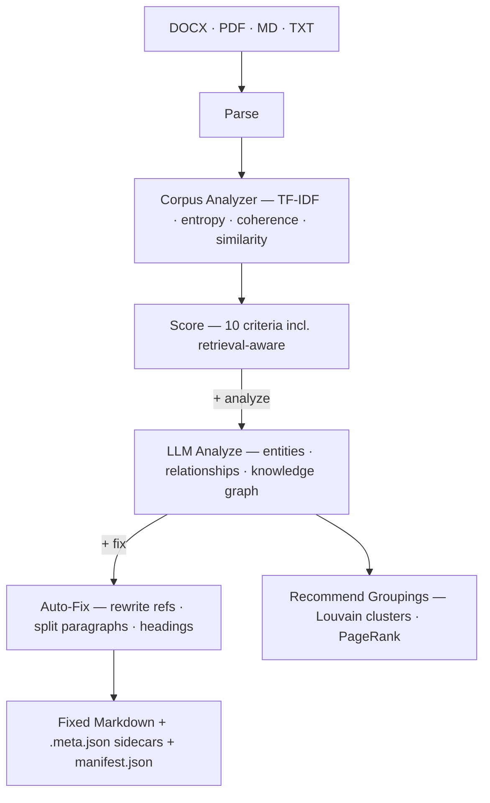

# ragprep

Document preparation pipeline for RAG systems. Scores, analyzes, and fixes documents before they reach your vector database.

Most RAG failures aren't embedding problems or chunk size problems. They're **document problems**: dangling references that make paragraphs meaningless in isolation, buried content that no query can find, headings that don't match the vocabulary users search with. ragprep catches these issues before upload, not after your users complain.

**What it does:**

- **Scores** documents across 10 criteria including a retrieval-aware metric that simulates search queries against your corpus to test whether each document can actually be found
- **Analyzes** content with an LLM to extract entities and relationships, building a knowledge graph across your entire corpus
- **Fixes** issues automatically — rewrites dangling references, splits long paragraphs, replaces generic headings, defines acronyms
- **Recommends** document groupings using [Louvain community detection](https://en.wikipedia.org/wiki/Louvain_method) and [TF-IDF](https://en.wikipedia.org/wiki/Tf%E2%80%93idf) similarity
- **Exports** machine-readable metadata — per-document `.meta.json` sidecars and a corpus-level `manifest.json` for downstream pipeline integration

Supports DOCX, PDF, TXT, and Markdown. Works with any vector database (Pinecone, Weaviate, Qdrant, Chroma, etc.) or RAG framework (LlamaIndex, LangChain, etc.).

### Pipeline




| Command   | What runs                                                                |
| --------- | ------------------------------------------------------------------------ |
| `score`   | Parse → Corpus Analyzer → Score                                          |
| `analyze` | + LLM analysis, knowledge graph, folder recommendations, metadata export |
| `fix`     | + auto-fix, writes improved Markdown + sidecar JSON to output directory  |


### Why retrieval-aware scoring?

Most document prep tools check structural quality — paragraph length, heading hierarchy, readability. These are useful but they're proxies. A document can pass every structural check and still be invisible to search if its vocabulary is too generic or too similar to other documents in the corpus.

The retrieval-aware scorer tests this directly: it generates synthetic queries from each document's highest TF-IDF terms, runs them against the full corpus, and measures how often the document appears in the results. A document scoring 90% is easy to find. A document scoring 30% will frustrate your users — and you'll know before you upload it. See the [eval test](test-data/layer1_information_theoretic/test_retrieval_aware_score.py) for validation against real scientific documents.

## Install

```bash
python3 -m venv .venv
source .venv/bin/activate
pip install -r requirements.txt
```

Python 3.10+ required. Optionally create a `.env` file for API keys (loaded automatically):

```bash
echo 'ANTHROPIC_API_KEY=sk-ant-...' >> .env
```

## Quick Start

```bash
# Score documents (no LLM, no API keys)
python -m src.cli score ./my-docs/
python -m src.cli score ./my-docs/ --detail        # show every issue
python -m src.cli score ./my-docs/ --json-output   # machine-readable

# Analyze with LLM (topics, knowledge graph, folder recommendations)
python -m src.cli analyze ./my-docs/ --llm-key $ANTHROPIC_API_KEY

# Auto-fix issues and output improved Markdown
python -m src.cli fix ./my-docs/ --llm-key $ANTHROPIC_API_KEY --output ./fixed/
```

## Commands

### `score` — RAG readiness scoring (no LLM)

```bash
python -m src.cli score <path> [options]
```


| Option           | Description                                     |
| ---------------- | ----------------------------------------------- |
| `--detail`       | Show per-issue breakdown for each document      |
| `--json-output`  | Output scores as JSON                           |
| `--exclude TEXT` | Skip files matching this substring (repeatable) |
| `--no-report`    | Don't generate the Markdown report file         |


### `analyze` — LLM content analysis + knowledge graph

```bash
python -m src.cli analyze <path> --llm-key $ANTHROPIC_API_KEY [options]
```


| Option                | Description                                                 |
| --------------------- | ----------------------------------------------------------- |
| `--llm-key TEXT`      | Anthropic API key (required)                                |
| `--model TEXT`        | LLM model override (default: claude-sonnet-4-20250514)      |
| `--concurrency N`     | Max parallel LLM calls (default: 5)                         |
| `--folder-hints PATH` | File with domain-specific folder guidance                   |
| `--json-output`       | Output manifest JSON to stdout (pipeable with `jq`)         |
| `--no-export-meta`    | Skip writing `.meta.json` sidecar files and `manifest.json` |
| `--export-chunks`     | Write per-document `.chunks.json` sidecars (default: on)    |
| `--chunk-size N`      | Target words per chunk (default: 220)                        |
| `--chunk-overlap N`   | Overlap words between chunks (default: 40)                   |
| `--run-benchmark`     | Run chunk-level retrieval benchmarks and export metrics       |
| `--skip-enrichment`   | Skip folder recommendation and graph-heavy output             |
| `--detail`            | Show per-issue breakdown                                    |
| `--exclude TEXT`      | Skip files matching this substring (repeatable)             |
| `--no-report`         | Don't generate the Markdown report file                     |


### `fix` — auto-fix issues and output improved Markdown

```bash
python -m src.cli fix <path> --llm-key $ANTHROPIC_API_KEY [options]
```


| Option                | Description                                                 |
| --------------------- | ----------------------------------------------------------- |
| `--llm-key TEXT`      | Anthropic API key (required)                                |
| `-o, --output DIR`    | Output directory (default: `rag-files-{timestamp}/`)        |
| `--fix-below N`       | Only fix documents scoring below this threshold             |
| `--model TEXT`        | LLM model override                                          |
| `--concurrency N`     | Max parallel LLM calls (default: 5)                         |
| `--folder-hints PATH` | File with domain-specific folder guidance                   |
| `--no-export-meta`    | Skip writing `.meta.json` sidecar files and `manifest.json` |
| `--chunk-size N`      | Target words per chunk (default: 220)                       |
| `--chunk-overlap N`   | Overlap words between chunks (default: 40)                  |
| `--exclude TEXT`      | Skip files matching this substring (repeatable)             |
| `--no-report`         | Don't generate the Markdown report file                     |


### Common options

All commands auto-generate a timestamped Markdown report (e.g. `ragprep-score-20260325-143000.md`). Suppress with `--no-report`. API keys can be set via `.env` file or environment variables instead of flags.

## How Scoring Works

Every command runs the scoring pipeline. It combines heuristic checks with corpus-level TF-IDF analysis — no LLM needed.

### Pipeline

```
Parse (DOCX/PDF/TXT/MD)
  │
  ├─ Corpus Analyzer ── TF-IDF matrix, document similarity, per-doc metrics
  │
  └─ Scorer ── 8 heuristic criteria + 1 retrieval-aware + 1 graph-powered
```

The **corpus analyzer** (`src/corpus_analyzer.py`) computes a TF-IDF matrix across all documents in one pass, then derives per-document metrics: topic entropy, heading-content coherence, readability grade, topic boundaries, and a self-retrieval score. These feed into the scorer alongside the existing heuristic checks.

### Scoring Criteria


| Criterion              | Weight | What It Checks                                                                                                                                       |
| ---------------------- | ------ | ---------------------------------------------------------------------------------------------------------------------------------------------------- |
| Self-Containment       | 20%    | Dangling references ("as mentioned above", "see section X") that break paragraph independence                                                        |
| Retrieval-Aware        | 20%    | Can the document be found by BM25+ queries about its own content? Generates synthetic queries from top TF-IDF terms and measures self-retrieval rate |
| Heading Quality        | 15%    | Hierarchy gaps, generic headings ("Content", "Notes"), heading density                                                                               |
| Paragraph Length       | 10%    | Too short (<15 words) or too long (>300 words)                                                                                                       |
| File Focus             | 10%    | Vocabulary entropy over TF-IDF term weights — flags documents with unusually diverse or uniform vocabulary                                           |
| Filename Quality       | 10%    | Generic names ("doc-v2.docx"), too short, no word separators                                                                                         |
| Structure Completeness | 10%    | Presence of headings, substantive body text, multiple sections                                                                                       |
| Acronym Definitions    | 5%     | Uppercase acronyms used repeatedly without "(definition)" nearby                                                                                     |
| Knowledge Completeness | 5%*    | Orphan references, isolated documents (*graph-powered, only with LLM analysis)                                                                       |
| File Size              | info   | Warns at 25MB, blocks at 50MB                                                                                                                        |


**Readiness levels:** EXCELLENT (85+), GOOD (70-84), FAIR (50-69), POOR (<50)

### Retrieval-Aware Scoring

The most distinctive criterion. For each document, the scorer:

1. Extracts the top TF-IDF terms (the document's most characteristic vocabulary)
2. Generates synthetic queries from 3-term combinations
3. Runs each query against the full corpus using BM25+
4. Measures what percentage of queries about this document actually find it in the top 5 results

A document that scores 80-100% is well-structured for retrieval. A document scoring below 40% has structural problems — buried content, generic vocabulary, or misleading headings — that make it hard to find via search.

### Corpus Analysis Metrics

The corpus analyzer also computes these metrics (informational only — available in the analysis output but not used for scoring):

- **Information density** — TF-IDF magnitude per section
- **Topic boundaries** — TextTiling-detected topic shifts within documents
- **Document similarity matrix** — cosine similarity between all document pairs
- **Readability grade** — Flesch-Kincaid grade level (computed but not scored — reading level appropriateness depends on your audience)

## Auto-Fix (LLM-Powered)

When you run `fix` with `--llm-key`, targeted prompts are sent to Claude to fix each detected issue:


| Issue               | Fix Applied                                             |
| ------------------- | ------------------------------------------------------- |
| Dangling references | Rewrites paragraph to include referenced context inline |
| Generic headings    | Generates descriptive heading from paragraph content    |
| Long paragraphs     | Splits into 2-4 focused sub-paragraphs                  |
| Undefined acronyms  | Inserts "(Full Name)" after first occurrence            |
| Generic filename    | Generates descriptive filename from content             |


Originals are never modified. Fixed files are written as clean Markdown to the output directory.

## Metadata Export

Both `analyze` and `fix` produce machine-readable JSON metadata alongside their output — so downstream RAG pipelines (LlamaIndex, LangChain, Pinecone, Weaviate, etc.) can consume the analysis results programmatically.

### Sidecar files

Each document gets a `.meta.json` file written next to its output:

```
output/
├── Insurance Concepts/
│   ├── insurance-types.md
│   └── insurance-types.meta.json    ← sidecar
├── Goal Setting/
│   ├── smart-goals.md
│   └── smart-goals.meta.json        ← sidecar
└── manifest.json                     ← corpus manifest
```

Each sidecar contains the document's analysis, scores, metrics, entities, relationships, and folder assignment:

```json
{
  "ragprep_version": "0.1.0",
  "source_file": "4-5.FL.10 Handout B. Types of Insurance.docx",
  "output_file": "insurance-types.md",
  "analysis": {
    "domain": "education",
    "topics": ["insurance", "risk management"],
    "summary": "Handout describing different types of insurance..."
  },
  "scores": {
    "overall": 72.5,
    "readiness": "GOOD",
    "criteria": { "self_containment": { "score": 88.0, "weight": 0.20, "issues": 1 } }
  },
  "metrics": {
    "entropy": 0.42,
    "coherence": 0.71,
    "self_retrieval_score": 0.65
  },
  "entities": [
    { "name": "Health Insurance", "type": "concept", "description": "Coverage for medical expenses" }
  ],
  "relationships": [
    { "source": "Health Insurance", "target": "Premium", "type": "related_to" }
  ],
  "folder": "Insurance Concepts"
}
```

### Corpus manifest

A single `manifest.json` at the output root contains corpus-level stats, all document entries, folder structure, knowledge graph (entities, relationships, clusters), document similarity matrix (for corpora under 100 documents), chunk benchmarks, and `split_recommendations` for broad documents.

### Usage

```bash
# fix writes sidecars + manifest by default
python -m src.cli fix ./my-docs/ --llm-key $KEY

# analyze writes to .ragprep/ subdirectory
python -m src.cli analyze ./my-docs/ --llm-key $KEY

# pipe manifest to jq
python -m src.cli analyze ./my-docs/ --llm-key $KEY --json-output | jq .corpus

# suppress metadata export
python -m src.cli fix ./my-docs/ --llm-key $KEY --no-export-meta
```

## Knowledge Graph

When LLM analysis runs (`analyze` or `fix` with `--llm-key`), an in-memory knowledge graph is built across all documents automatically.

The LLM extracts **entities** and **relationships** from each document. Before merging into the graph, a confidence check filters out low-quality analyses — if the LLM returned too few entities for the document's size, no relationships, or only a single entity type (suggesting it defaulted), the analysis is kept for its metadata but its entities are excluded from the graph. This prevents bad LLM output from poisoning clustering and folder recommendations.

Entities that pass the confidence check are merged into a shared [networkx](https://networkx.org/) directed graph using TF-IDF cosine similarity on character n-grams (threshold 0.4) — this handles morphological variation ("Budget" matches "Budgeting"), word reordering, and typos. The low threshold trades precision for recall; in large corpora with many short entity names, some spurious merges are possible.


| Entity types                                          | Relationship types                                      |
| ----------------------------------------------------- | ------------------------------------------------------- |
| concept, skill, lesson, resource, assessment, process | prerequisite, related_to, part_of, assesses, influences |


### Graph analysis

- **Louvain community detection** — clusters entities in the knowledge graph for folder recommendations (seeded for determinism)
- **Spectral clustering** — deterministic document grouping using the eigengap heuristic on the TF-IDF similarity matrix (available as an alternative to Louvain)
- **PageRank** — ranks entities by structural importance for folder naming
- **Betweenness centrality** — identifies bridge entities connecting topic clusters
- **Bipartite projection** — document-document similarity via shared entities (blended with TF-IDF similarity)
- **Folder coherence validation** — silhouette analysis scores whether folder assignments actually group similar documents

### Downstream consumers

- **Scorer** — orphan references and cross-document connectivity (Knowledge Completeness criterion)
- **Fixer** — cross-document context for resolving dangling references ("see Unit 2" gets actual Unit 2 content)
- **Recommender** — graph clusters + PageRank for folder naming, silhouette validation for assignment quality

## Document Grouping

The tool recommends how to group documents using a 4-tier priority: graph clusters + LLM naming (best), LLM-only, graph-only, or heuristic fallback. These groupings appear in the metadata export and the analysis report:

```
Engineering - API Design
Engineering - Architecture
Product - Requirements
Product - User Research
Onboarding
```

## Testing

Two test suites: **unit tests** (fast, no downloads) and an **eval suite** (validates against published benchmarks and real documents).

### Unit tests

```bash
source .venv/bin/activate
python3 -m pytest tests/ -v          # 76 tests, ~3 seconds
```

Tests the scoring pipeline, graph builder, corpus analyzer, parser, and CLI report generation using synthetic documents and mocked LLM calls. No API keys or downloads needed.

### Eval suite

The eval suite validates every algorithm in the analysis engine against real-world datasets. It tests the *components* (entropy, coherence, entity resolution, clustering, chunking, retrieval) against published benchmarks — not the LLM-dependent features (analyze, fix).

```bash
# Install eval dependencies (one-time)
pip install -r test-data/requirements-test.txt

# Download datasets (~440MB, one-time, gitignored)
python test-data/setup.py

# Run all 63 eval tests (~65 seconds)
python3 -m pytest test-data/ -v
```

**Datasets downloaded by `setup.py`:**


| Dataset           | Source                                          | Size    | What it provides                                                                |
| ----------------- | ----------------------------------------------- | ------- | ------------------------------------------------------------------------------- |
| SQuAD 1.1         | HuggingFace `squad`                             | 33 MB   | 2,067 Wikipedia paragraphs with questions + answers                             |
| BEIR/SciFact      | HuggingFace `BeIR/scifact-generated-queries`    | ~50 MB  | 5,183 scientific documents with queries                                         |
| BEIR/NFCorpus     | HuggingFace `BeIR/nfcorpus-generated-queries`   | ~30 MB  | 3,633 medical documents with queries                                            |
| BEIR/TREC-COVID   | HuggingFace `BeIR/trec-covid-generated-queries` | ~200 MB | 166,944 COVID research documents                                                |
| CUAD              | HuggingFace `theatticusproject/cuad`            | 11 MB   | 509 legal contract texts with clause annotations                                |
| HotpotQA          | HuggingFace `hotpotqa`                          | ~20 MB  | 500 multi-hop questions with supporting facts                                   |
| 20 Newsgroups     | scikit-learn built-in                           | 14 MB   | 18,846 documents across 20 labeled categories                                   |
| Choi Segmentation | GitHub `koomri/text-segmentation`               | <5 MB   | 920 documents with known topic boundaries                                       |
| FB15k-237         | GitHub mirror                                   | 27 MB   | 310K knowledge graph triples for PageRank validation                            |
| STS Benchmark     | HuggingFace `sentence-transformers/stsb`        | <1 MB   | 1,379 sentence pairs with similarity scores                                     |
| arXiv Sample      | HuggingFace `CShorten/ML-ArXiv-Papers`          | ~10 MB  | 200 ML paper titles + abstracts                                                 |
| Leipzig ER        | `dbs.uni-leipzig.de`                            | ~20 MB  | 4 entity resolution benchmarks (Abt-Buy, Amazon-Google, DBLP-ACM, DBLP-Scholar) |
| SCORE-Bench       | HuggingFace `unstructuredio/SCORE-Bench`        | 15 MB   | 30 real-world PDFs with expert text annotations                                 |
| OmniDocBench      | HuggingFace `opendatalab/OmniDocBench`          | 63 MB   | 30 documents with layout/section annotations                                    |
| Kleister NDA      | GitHub `applicaai/kleister-nda`                 | 3.5 MB  | 50 real NDA PDFs with entity annotations                                        |


No API keys needed. All datasets are freely available.

**What each layer tests:**


| Layer                | What it validates                                                                                                                                                     | Datasets                                                                                 | Example threshold                      |
| -------------------- | --------------------------------------------------------------------------------------------------------------------------------------------------------------------- | ---------------------------------------------------------------------------------------- | -------------------------------------- |
| Layer 1 — Scoring    | Entropy distinguishes formulaic vs diverse text; coherence detects mismatched headings (Wilcoxon p<0.01); retrieval-aware scores are non-degenerate                   | SQuAD, CUAD, BEIR/SciFact, 20 Newsgroups                                                 | Contracts entropy < newsgroups entropy |
| Layer 2 — Graph      | Entity resolution F1 against published ER benchmarks; spectral clustering NMI/ARI on labeled categories; PageRank correlates with in-degree                           | Leipzig ER, FB15k-237, 20 Newsgroups                                                     | DBLP-ACM F1 >= 0.80                    |
| Layer 3 — Chunking   | TextTiling Pk on annotated segmentation corpus; info-dense overlap selects higher TF-IDF sentences                                                                    | Choi segmentation                                                                        | Pk <= 0.44                             |
| Layer 4 — Retrieval  | BM25+ relevance ordering; Rocchio expansion adds domain terms; silhouette validates clustering quality                                                                | SQuAD, 20 Newsgroups                                                                     | True labels > random labels            |
| Layer 5 — End-to-end | Full round-trip: write .docx/.md files → parse → score → chunk → BM25 retrieve → measure hit rate. Also: parse real PDFs and compare against ground truth annotations | SQuAD (synthetic files), SCORE-Bench (real PDFs), Kleister NDA (real PDFs), OmniDocBench | Parse fidelity F1 >= 0.60              |
| Cross-layer          | Edge cases (empty/unicode/stopwords), TF-IDF consistency across layers, performance benchmarks (<30s for 20K docs)                                                    | Synthetic, 20 Newsgroups                                                                 | No crashes, no NaN                     |


**Run a single layer:**

```bash
python3 -m pytest test-data/ -m layer1 -v
python3 -m pytest test-data/ -m layer5 -v
python3 -m pytest test-data/ -m cross_layer -v
```

**Clean up downloaded data:**

```bash
./test-data/cleanup.sh
```

### What the eval suite does NOT test

- **LLM features** (analyze, fix) — these call the Claude API, which costs money and is non-deterministic. The unit tests mock these calls.
- **Knowledge graph quality** — the graph is built from LLM-extracted entities. The eval tests validate the graph *algorithms* (entity resolution, clustering, PageRank) but not the quality of the LLM extraction.

## Supported File Types


| Format | Parsing                                                |
| ------ | ------------------------------------------------------ |
| .docx  | Full (headings, paragraphs, metadata)                  |
| .pdf   | Full (font-based heading detection, paragraph merging) |
| .md    | Full (Markdown heading syntax)                         |
| .txt   | Basic (paragraph splitting)                            |


## Project Structure

```
ragprep/
├── src/                         # Source package
│   ├── cli.py                   # CLI entry point (Click) — score, analyze, fix
│   ├── corpus_analyzer.py       # TF-IDF matrix, entropy, coherence, retrieval-aware scoring
│   ├── scorer.py                # Heuristic + corpus-powered scoring criteria
│   ├── parser.py                # DOCX/PDF/TXT/MD parsing + Markdown conversion
│   ├── analyzer.py              # LLM content analysis (topics, entities, relationships)
│   ├── graph_builder.py         # Knowledge graph (networkx) + spectral clustering + PageRank
│   ├── fixer.py                 # LLM auto-fix engine (graph-aware)
│   ├── recommender.py           # Document grouping + silhouette validation
│   ├── export.py                # JSON metadata export (sidecars + manifest)
│   ├── prompts.py               # LLM prompt templates
│   ├── config.py                # Settings and API key management
│   └── models.py                # All dataclasses
├── tests/                       # Unit tests (76 tests, no downloads)
│   ├── test_corpus_analyzer.py
│   ├── test_scoring.py
│   ├── test_graph.py
│   ├── test_integration.py
│   ├── test_async_analyzer.py
│   ├── test_async_fixer.py
│   ├── test_config.py
│   ├── test_report.py
│   ├── test_export.py           # Metadata export tests
│   └── test_recommender.py      # Document grouping tests
├── test-data/                   # Eval suite (63 tests, needs setup.py)
│   ├── setup.py                 # Downloads ~440MB of benchmark datasets
│   ├── cleanup.sh               # Removes downloaded data
│   ├── conftest.py              # Fixtures + engine adapter
│   ├── requirements-test.txt
│   ├── layer1_information_theoretic/
│   ├── layer2_spectral_graph/
│   ├── layer3_semantic_chunking/
│   ├── layer4_retrieval/
│   ├── layer5_rag_quality/      # Includes real PDF tests
│   ├── cross_layer/
│   └── corpora/                 # Downloaded data (gitignored)
├── pyproject.toml
├── README.md
└── CLAUDE.md
```

## Requirements

- `python-docx` — DOCX parsing
- `PyMuPDF` — PDF parsing
- `click` — CLI framework
- `rich` — terminal formatting
- `anthropic` — Claude API (only needed for analyze/fix/LLM features)
- `networkx` — knowledge graph
- `numpy` — numerical computation
- `scipy` — signal processing (TextTiling), sparse matrices
- `scikit-learn` — TF-IDF vectorization, spectral clustering, cosine similarity
- `python-dotenv` — `.env` file support for API keys

## TODO

- **Structured LLM output** — replace JSON-in-markdown prompts with tool_use for reliable extraction
- **Incremental analysis** — cache per-file LLM results so `fix` doesn't re-run the full `analyze` pipeline. Currently `fix` repeats all LLM analysis calls from scratch
- **Relationship deduplication** — merge duplicate edges and track edge weight/frequency
- **Configurable thresholds** — entropy thresholds are now in corpus_analyzer; still need to expose scoring weights and cluster resolution as CLI flags or config
- **Export graph** — the knowledge graph is included in `manifest.json`; add standalone export as GraphML or DOT for visualization tools

