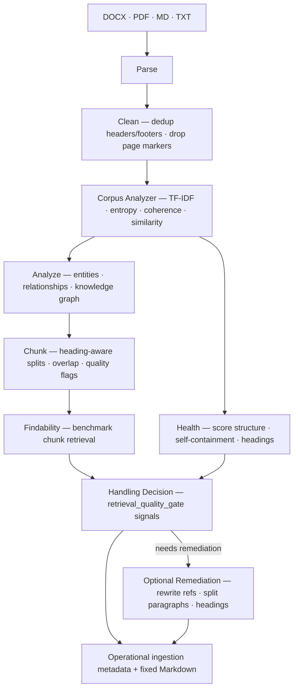

# IngestGate

Retrieval Quality Gate for RAG pipelines.

RAG failures often start before embeddings, rerankers, or vector databases. They start with documents that are hard to chunk cleanly, hard to retrieve reliably, or hard to route into the right ingestion path. **IngestGate** acts as a Retrieval Quality Gate between parsing and ingestion.

It answers three practical questions:

- **Health**: is the document structurally healthy enough for retrieval?
- **Findability**: can the document's chunks actually be found by realistic queries?
- **Handling decision**: how should this document be ingested and retrieved?

What the gate produces:

- **Score**: weighted health signals across structure, self-containment, headings, paragraph shape, retrieval-aware quality, and more
- **Benchmark**: chunk-level retrieval evidence (`Recall@5`, `MRR`, `nDCG@5`) from deterministic queries
- **IngestGate decision support**: operational ingestion metadata and decision support via `retrieval_quality_gate` signals in sidecars and manifest output
- **Remediation**: optional automatic fixes for chunk safety, headings, long paragraphs, and acronym definitions

Supports DOCX, PDF, TXT, and Markdown. Works upstream of any vector database or retrieval stack (Pinecone, Weaviate, pgvector, Qdrant, Chroma, LangChain, LlamaIndex, custom pipelines).

This project is not a vector database, embedding service, or hosted RAG runtime. It is the gate you run before ingestion.

### Pipeline


### Positioning

- Platform services increasingly handle parsing/chunking/embedding.
- IngestGate focuses on what those platforms generally do not provide: pre-ingestion quality scoring, retrieval benchmarking, handling recommendations, and structured quality metadata.
- For managed end-to-end offerings (for example Pinecone Assistant), it still adds value as an upstream decision layer.

### Current and Upcoming Vendor Landscape

*Landscape snapshot as of 2026-03. This section should be revisited as platform capabilities evolve.*

Parsing, chunking, embedding, and serving are increasingly bundled by vendors, but pre-ingestion quality control is still mostly user-owned.

| Area                     | Vendor trend (current + upcoming)                                                                                                                              | IngestGate role                                                                                   |
| ------------------------ | -------------------------------------------------------------------------------------------------------------------------------------------------------------- | ------------------------------------------------------------------------------------------------- |
| Parsing and chunking     | Managed products (for example Pinecone Assistant) already parse/chunk automatically; PostgreSQL ecosystem tools like pgai are expanding parser/chunker support | Structure-aware chunking that preserves heading hierarchy and emits chunk quality metadata        |
| Embeddings and retrieval | Pinecone/Weaviate/pgvector ecosystems all support strong vector retrieval; hybrid and reranking are improving quickly                                          | Retrieval-readiness scoring before ingestion (self-retrieval and benchmark signals)               |
| Metadata enrichment      | Platforms can store/filter metadata, and some add post-ingestion enrichment agents                                                                             | Generate quality metadata before ingestion (`.meta.json`, `.chunks.json`, `manifest.json`)        |
| Quality assurance        | No major vendor provides robust pre-ingestion quality scoring + content repair workflow                                                                        | Core differentiation: scoring, chunk-safe fixes, split recommendations, and quality-gate workflow |

Bottom line: vendor platforms are getting better at ingestion mechanics; IngestGate is the quality layer that helps ensure what gets ingested is actually retrievable and understandable.


### Recommended Workflow

Use this sequence for predictable quality-gate behavior:

1. Run `score` first for a fast baseline without LLM cost.
2. Run `analyze` with `--run-benchmark` to evaluate chunk-level retrieval quality before remediation.
3. Review `.ingestgate/manifest.json` for health, findability, and handling-decision signals.
4. Run `fix` only when results are below your bar, then re-run `analyze --run-benchmark` to confirm improvement.

### Operating profile (default)

Use **balanced** as the default operating profile:

- `--pass-threshold 85`
- `--pass-with-notes-threshold 70`
- `--remediation-threshold 50`

For most teams, this keeps gate decisions actionable without creating unnecessary review load.

Other profiles:

- **strict**: `90 / 75 / 60` (more docs move from `PASS` to `PASS_WITH_NOTES`)
- **lenient**: `80 / 65 / 45` (fewer docs are flagged for follow-up)

Example:

```bash
# 0) Environment setup (first run)
python3 -m venv .venv
source .venv/bin/activate
pip install -r requirements.txt

# 1) Baseline (no LLM)
ingestgate score ./my-docs/ --detail \
  --pass-threshold 85 --pass-with-notes-threshold 70 --remediation-threshold 50

# 2) Retrieval evaluation
ingestgate analyze ./my-docs/ --llm-key $ANTHROPIC_API_KEY --run-benchmark \
  --pass-threshold 85 --pass-with-notes-threshold 70 --remediation-threshold 50

# 3) Remediate if needed
ingestgate fix ./my-docs/ --llm-key $ANTHROPIC_API_KEY \
  --pass-threshold 85 --pass-with-notes-threshold 70 --remediation-threshold 50

# 4) Re-measure after fixes
ingestgate analyze ./my-docs/ --llm-key $ANTHROPIC_API_KEY --run-benchmark \
  --pass-threshold 85 --pass-with-notes-threshold 70 --remediation-threshold 50
```

### Why retrieval-aware scoring?

Most document prep tools check structural quality — paragraph length, heading hierarchy, readability. These are useful but they're proxies. A document can pass every structural check and still be invisible to search if its vocabulary is too generic or too similar to other documents in the corpus.

The retrieval-aware scorer tests this directly: it generates synthetic queries from each document's highest TF-IDF terms, runs them against the full corpus, and measures how often the document appears in the results. A document scoring 90% is easy to find. A document scoring 30% will frustrate your users, and you'll know before you upload it. See the [eval test](test-data/layer1_information_theoretic/test_retrieval_aware_score.py) for validation against real scientific documents.

## Install

```bash
python3 -m venv .venv
source .venv/bin/activate
pip install -r requirements.txt
```

Python 3.10+ required. Optionally create a `.env` file for API keys (loaded automatically):

```bash
echo 'ANTHROPIC_API_KEY=sk-ant-...' >> .env
```

## Quick Start

| Command   | What runs                                                                          |
| --------- | ---------------------------------------------------------------------------------- |
| `score`   | Parse → Corpus Analyzer → Score (`health`)                                         |
| `analyze` | + LLM analysis, knowledge graph, chunking, benchmark, metadata export (`findability` + `handling decision`) |
| `fix`     | + auto-fix, writes improved Markdown + sidecar JSON to output directory (`remediation`) |

```bash
# Score documents (no LLM, no API keys)
ingestgate score ./my-docs/
ingestgate score ./my-docs/ --detail        # show every issue
ingestgate score ./my-docs/ --json-output   # machine-readable

# Analyze with LLM (topics, knowledge graph, chunking)
ingestgate analyze ./my-docs/ --llm-key $ANTHROPIC_API_KEY

# Auto-fix issues and output improved Markdown
ingestgate fix ./my-docs/ --llm-key $ANTHROPIC_API_KEY --output ./fixed/
```

## Commands

### `score` — document health scan (no LLM)

```bash
ingestgate score <path> [options]
```


| Option           | Description                                     |
| ---------------- | ----------------------------------------------- |
| `--detail`       | Show per-issue breakdown for each document      |
| `--json-output`  | Output scores as JSON                           |
| `--exclude TEXT` | Skip files matching this substring (repeatable) |
| `--no-report`    | Don't generate the Markdown report file         |
| `--pass-threshold N` | Minimum score for `PASS` (default: 85)      |
| `--pass-with-notes-threshold N` | Minimum score for `PASS_WITH_NOTES` (default: 70) |
| `--remediation-threshold N` | Minimum score for `REMEDIATION_RECOMMENDED` (default: 50) |


### `analyze` — findability benchmark + decision support

```bash
ingestgate analyze <path> --llm-key $ANTHROPIC_API_KEY [options]
```


| Option                | Description                                                 |
| --------------------- | ----------------------------------------------------------- |
| `--llm-key TEXT`      | Anthropic API key (required)                                |
| `--model TEXT`        | LLM model override (default: claude-sonnet-4-20250514)      |
| `--concurrency N`     | Max parallel LLM calls (default: 5)                         |
| `--json-output`       | Output manifest JSON to stdout (pipeable with `jq`)         |
| `--no-export-meta`    | Skip writing `.meta.json` sidecar files and `manifest.json` |
| `--export-chunks`     | Write per-document `.chunks.json` sidecars (default: on)    |
| `--chunk-size N`      | Target words per chunk (default: 220)                       |
| `--chunk-overlap N`   | Overlap words between chunks (default: 40)                  |
| `--run-benchmark`     | Run chunk-level retrieval benchmarks and export metrics     |
| `--web-report`        | Generate an interactive local HTML dashboard                |
| `--detail`            | Show per-issue breakdown                                    |
| `--exclude TEXT`      | Skip files matching this substring (repeatable)             |
| `--no-report`         | Don't generate the Markdown report file                     |
| `--pass-threshold N`  | Minimum score for `PASS` (default: 85)                      |
| `--pass-with-notes-threshold N` | Minimum score for `PASS_WITH_NOTES` (default: 70) |
| `--remediation-threshold N` | Minimum score for `REMEDIATION_RECOMMENDED` (default: 50) |


### `fix` — remediation before ingestion

```bash
ingestgate fix <path> --llm-key $ANTHROPIC_API_KEY [options]
```


| Option                | Description                                                 |
| --------------------- | ----------------------------------------------------------- |
| `--llm-key TEXT`      | Anthropic API key (required)                                |
| `-o, --output DIR`    | Output directory (default: `ingestgate-files-{timestamp}/`) |
| `--fix-below N`       | Only fix documents scoring below this threshold             |
| `--model TEXT`        | LLM model override                                          |
| `--concurrency N`     | Max parallel LLM calls (default: 5)                         |
| `--no-export-meta`    | Skip writing `.meta.json` sidecar files and `manifest.json` |
| `--chunk-size N`      | Target words per chunk (default: 220)                       |
| `--chunk-overlap N`   | Overlap words between chunks (default: 40)                  |
| `--web-report`        | Generate an interactive local HTML dashboard                |
| `--exclude TEXT`      | Skip files matching this substring (repeatable)             |
| `--no-report`         | Don't generate the Markdown report file                     |
| `--pass-threshold N`  | Minimum score for `PASS` (default: 85)                      |
| `--pass-with-notes-threshold N` | Minimum score for `PASS_WITH_NOTES` (default: 70) |
| `--remediation-threshold N` | Minimum score for `REMEDIATION_RECOMMENDED` (default: 50) |


### Common options

All commands auto-generate a timestamped Markdown report (e.g. `ingestgate-score-20260325-143000.md`). Reports now include a Gate Decision Rationale section with decision counts and per-document drivers. Use `--web-report` on `analyze`/`fix` to also emit an interactive local HTML dashboard. Suppress Markdown output with `--no-report`. API keys can be set via `.env` file or environment variables instead of flags.

## How Quality Is Measured

The gate combines three layers of signal:

1. **Health** — heuristic document quality checks such as self-containment, headings, paragraph shape, and structure.
2. **Findability** — retrieval-aware scoring and optional chunk benchmarks that test whether content can actually be found.
3. **Handling decision** — `retrieval_quality_gate` signals that recommend how a document should be ingested and retrieved.

Every command runs the health layer. `analyze --run-benchmark` adds the strongest findability evidence. Metadata export captures the handling decision.

### Pipeline

```
Parse (DOCX/PDF/TXT/MD)
  │
  ├─ Clean ── dedup headers/footers, drop page markers
  │
  ├─ Corpus Analyzer ── TF-IDF matrix, document similarity, per-doc metrics
  │
  └─ Scorer ── 8 heuristic criteria + 1 retrieval-aware + 1 graph-powered
```

The **corpus analyzer** (`src/corpus_analyzer.py`) computes a TF-IDF matrix across all documents in one pass, then derives per-document metrics: topic entropy, heading-content coherence, readability grade, topic boundaries, and a self-retrieval score. These feed into the health score and benchmark workflow alongside the existing heuristic checks.

### Scoring Criteria


| Criterion              | Weight | What It Checks                                                                                                                                       |
| ---------------------- | ------ | ---------------------------------------------------------------------------------------------------------------------------------------------------- |
| Self-Containment       | 20%    | Dangling references ("as mentioned above", "see section X") that break paragraph independence                                                        |
| Retrieval-Aware        | 20%    | Can the document be found by BM25+ queries about its own content? Generates synthetic queries from top TF-IDF terms and measures self-retrieval rate |
| Heading Quality        | 15%    | Hierarchy gaps, generic headings ("Content", "Notes"), heading density                                                                               |
| Paragraph Length       | 10%    | Too short (<15 words) or too long (>300 words)                                                                                                       |
| File Focus             | 10%    | Vocabulary entropy over TF-IDF term weights — flags documents with unusually diverse or uniform vocabulary                                           |
| Filename Quality       | 10%    | Generic names ("doc-v2.docx"), too short, no word separators                                                                                         |
| Structure Completeness | 10%    | Presence of headings, substantive body text, multiple sections                                                                                       |
| Acronym Definitions    | 5%     | Uppercase acronyms used repeatedly without "(definition)" nearby                                                                                     |
| Knowledge Completeness | 5%*    | Orphan references, isolated documents (*graph-powered, only with LLM analysis)                                                                       |
| File Size              | info   | Warns at 25MB, blocks at 50MB                                                                                                                        |


**Gate decisions:** `PASS` (85+), `PASS_WITH_NOTES` (70-84), `REMEDIATION_RECOMMENDED` (50-69), `HOLD_FOR_REVIEW` (<50 or any critical issue)

For backward compatibility, sidecars and manifests still include the legacy score-band label (`readiness`: `EXCELLENT/GOOD/FAIR/POOR`) alongside the new `gate_decision` field.

Need different cutoffs for your corpus? Use:
- `--pass-threshold`
- `--pass-with-notes-threshold`
- `--remediation-threshold`

These are available on `score`, `analyze`, and `fix`.

### Retrieval-Aware Scoring

The most distinctive criterion. For each document, the scorer:

1. Extracts the top TF-IDF terms (the document's most characteristic vocabulary)
2. Generates synthetic queries from 3-term combinations
3. Runs each query against the full corpus using BM25+
4. Measures what percentage of queries about this document actually find it in the top 5 results

A document that scores 80-100% is well-structured for retrieval. A document scoring below 40% has structural problems — buried content, generic vocabulary, or misleading headings — that make it hard to find via search.

### Corpus Analysis Metrics

The corpus analyzer also computes these metrics (informational only — available in the analysis output but not used for scoring):

- **Information density** — TF-IDF magnitude per section
- **Topic boundaries** — TextTiling-detected topic shifts within documents
- **Document similarity matrix** — cosine similarity between all document pairs
- **Readability grade** — Flesch-Kincaid grade level (computed but not scored — reading level appropriateness depends on your audience)

## Auto-Fix (LLM-Powered)

When you run `fix` with `--llm-key`, targeted prompts are sent to Claude to fix each detected issue:


| Issue               | Fix Applied                                             |
| ------------------- | ------------------------------------------------------- |
| Dangling references | Rewrites paragraph to include referenced context inline |
| Generic headings    | Generates descriptive heading from paragraph content    |
| Long paragraphs     | Splits into 2-4 focused sub-paragraphs                  |
| Undefined acronyms  | Inserts "(Full Name)" after first occurrence            |
| Generic filename    | Generates descriptive filename from content             |


Originals are never modified. Fixed files are written as clean Markdown to the output directory.

## Chunking

The `analyze` command produces heading-aware chunks for every document; `fix` also chunks when metadata export is enabled. The chunker splits text at heading boundaries first, then applies word-level windowing within each section.

- **Heading-preserving** — chunks never cross heading boundaries. Each chunk carries its full heading path (e.g. `["Unit 3", "Budgeting", "Income Sources"]`).
- **Configurable size** — `--chunk-size 220` (target words per chunk) and `--chunk-overlap 40` (words shared between adjacent chunks). Defaults produce chunks of roughly 200-250 words.
- **Quality metadata** — each chunk records its source document, paragraph range, token estimate, and quality flags.

Chunk output is written as `.chunks.json` sidecar files alongside `.meta.json`. For `analyze`, suppress with `--no-export-chunks`.

### Retrieval benchmarks

Pass `--run-benchmark` to measure how well chunks retrieve against deterministic queries built from headings and top TF-IDF terms:

```bash
ingestgate analyze ./my-docs/ --llm-key $KEY --run-benchmark
```

Benchmark results (Recall@5, MRR, nDCG@5) are included in `manifest.json` under the `benchmarks` key.

## Cleanup

Before scoring and chunking, a deterministic cleaner runs on all parsed documents:

- Removes repeated short phrases (headers/footers that appear on every page)
- Drops `Page N` markers

This runs automatically — no flags needed.

## Metadata Export

Both `analyze` and `fix` produce machine-readable JSON metadata alongside their output. This is the project’s main operational output: ingestion metadata and decision support for downstream RAG pipelines (LlamaIndex, LangChain, Pinecone, Weaviate, custom ingestion scripts, etc.).

### Sidecar files

Each document gets a `.meta.json` file written next to its output:

```
output/
├── insurance-types.md
├── insurance-types.meta.json     ← analysis sidecar
├── insurance-types.chunks.json   ← chunk sidecar
├── smart-goals.md
├── smart-goals.meta.json
├── smart-goals.chunks.json
└── manifest.json                 ← corpus manifest
```

Each `.meta.json` sidecar contains the document's analysis, scores, metrics, entities, relationships, and a `retrieval_quality_gate` block with deterministic handling recommendations, modality readiness flags, and evidence. Each `.chunks.json` sidecar contains the heading-aware chunks with metadata.

Analysis sidecar example:

```json
{
  "ingestgate_version": "0.1.0",
  "source_file": "4-5.FL.10 Handout B. Types of Insurance.docx",
  "output_file": "insurance-types.md",
  "analysis": {
    "domain": "education",
    "topics": ["insurance", "risk management"],
    "summary": "Handout describing different types of insurance..."
  },
  "scores": {
    "overall": 72.5,
    "readiness": "GOOD",
    "gate_decision": "PASS_WITH_NOTES",
    "criteria": { "self_containment": { "score": 88.0, "weight": 0.20, "issues": 1 } }
  },
  "metrics": {
    "entropy": 0.42,
    "coherence": 0.71,
    "self_retrieval_score": 0.65
  },
  "entities": [
    { "name": "Health Insurance", "type": "concept", "description": "Coverage for medical expenses" }
  ],
  "relationships": [
    { "source": "Health Insurance", "target": "Premium", "type": "related_to" }
  ],
  "retrieval_quality_gate": {
    "retrieval_mode_hint": {
      "recommended_mode": "text_hybrid_default",
      "confidence": "high",
      "reasons": ["clean_text_for_standard_retrieval"]
    },
    "modality_readiness": {
      "text_only_ready": true,
      "layout_heavy_pdf": false,
      "template_like_document": false
    }
  }
}
```

### Corpus manifest

A single `manifest.json` at the output root contains corpus-level stats (including `retrieval_mode_distribution` and `gate_decision_distribution`), all document entries (including per-document `retrieval_quality_gate`), knowledge graph (entities, relationships, clusters), document similarity matrix (for corpora under 100 documents), chunk benchmarks, and `split_recommendations` for broad documents.

In practice, operators usually read it in this order:

1. `corpus` for overall health and mode distribution
2. `benchmarks` for findability evidence
3. `documents[*].retrieval_quality_gate` for per-document handling decisions

For day-to-day operations, follow the SOP in [`docs/sops/ingestion-operations.md`](docs/sops/ingestion-operations.md). Use [`docs/manifest-deep-dive.md`](docs/manifest-deep-dive.md) as the field-level reference companion, and [`docs/guides/weaviate-ingestion.md`](docs/guides/weaviate-ingestion.md) for end-to-end ingestion wiring.

### Usage

```bash
# fix writes sidecars + manifest by default
ingestgate fix ./my-docs/ --llm-key $KEY

# analyze writes metadata to ./my-docs/.ingestgate/ (directory input expected)
ingestgate analyze ./my-docs/ --llm-key $KEY

# for focused analysis, use --exclude to narrow the set within a directory
ingestgate analyze ./my-docs/ --llm-key $KEY --exclude "draft"

# pipe manifest to jq
ingestgate analyze ./my-docs/ --llm-key $KEY --json-output | jq .corpus

# suppress metadata export
ingestgate fix ./my-docs/ --llm-key $KEY --no-export-meta
```

## Knowledge Graph

When LLM analysis runs (`analyze` or `fix` with `--llm-key`), an in-memory knowledge graph is built across all documents automatically.

The LLM extracts **entities** and **relationships** from each document. Before merging into the graph, a confidence check filters out low-quality analyses — if the LLM returned too few entities for the document's size, no relationships, or only a single entity type (suggesting it defaulted), the analysis is kept for its metadata but its entities are excluded from the graph. This prevents bad LLM output from poisoning the graph and downstream scoring.

Entities that pass the confidence check are merged into a shared [networkx](https://networkx.org/) directed graph using TF-IDF cosine similarity on character n-grams (threshold 0.4) — this handles morphological variation ("Budget" matches "Budgeting"), word reordering, and typos. The low threshold trades precision for recall; in large corpora with many short entity names, some spurious merges are possible.


| Entity types                                          | Relationship types                                      |
| ----------------------------------------------------- | ------------------------------------------------------- |
| concept, skill, lesson, resource, assessment, process | prerequisite, related_to, part_of, assesses, influences |


### Graph analysis

- **Louvain community detection** — clusters entities in the knowledge graph (seeded for determinism)
- **Spectral clustering** — deterministic document clustering using the eigengap heuristic on the TF-IDF similarity matrix
- **PageRank** — ranks entities by structural importance
- **Betweenness centrality** — identifies bridge entities connecting topic clusters
- **Bipartite projection** — document-document similarity via shared entities (blended with TF-IDF similarity)

### Downstream consumers

- **Scorer** — orphan references and cross-document connectivity (Knowledge Completeness criterion)
- **Fixer** — cross-document context for resolving dangling references ("see Unit 2" gets actual Unit 2 content)
## Testing

Two test suites: **unit tests** (fast, no downloads) and an **eval suite** (validates against published benchmarks and real documents).

### Unit tests

```bash
source .venv/bin/activate
python3 -m pytest tests/ -v          # 91 tests, ~3 seconds
```

Tests the scoring pipeline, graph builder, corpus analyzer, chunker, benchmark metrics, cleaner, parser, and CLI report generation using synthetic documents and mocked LLM calls. No API keys or downloads needed.

### Eval suite

The eval suite validates every algorithm in the analysis engine against real-world datasets. It tests the *components* (entropy, coherence, entity resolution, clustering, chunking, retrieval) against published benchmarks — not the LLM-dependent features (analyze, fix).

```bash
# Install eval dependencies (one-time)
pip install -r test-data/requirements-test.txt

# Download datasets (~440MB, one-time, gitignored)
python test-data/setup.py

# Run all 63 eval tests (~65 seconds)
python3 -m pytest test-data/ -v
```

**Datasets downloaded by `setup.py`:**


| Dataset           | Source                                          | Size    | What it provides                                                                |
| ----------------- | ----------------------------------------------- | ------- | ------------------------------------------------------------------------------- |
| SQuAD 1.1         | HuggingFace `squad`                             | 33 MB   | 2,067 Wikipedia paragraphs with questions + answers                             |
| BEIR/SciFact      | HuggingFace `BeIR/scifact-generated-queries`    | ~50 MB  | 5,183 scientific documents with queries                                         |
| BEIR/NFCorpus     | HuggingFace `BeIR/nfcorpus-generated-queries`   | ~30 MB  | 3,633 medical documents with queries                                            |
| BEIR/TREC-COVID   | HuggingFace `BeIR/trec-covid-generated-queries` | ~200 MB | 166,944 COVID research documents                                                |
| CUAD              | HuggingFace `theatticusproject/cuad`            | 11 MB   | 509 legal contract texts with clause annotations                                |
| HotpotQA          | HuggingFace `hotpotqa`                          | ~20 MB  | 500 multi-hop questions with supporting facts                                   |
| 20 Newsgroups     | scikit-learn built-in                           | 14 MB   | 18,846 documents across 20 labeled categories                                   |
| Choi Segmentation | GitHub `koomri/text-segmentation`               | <5 MB   | 920 documents with known topic boundaries                                       |
| FB15k-237         | GitHub mirror                                   | 27 MB   | 310K knowledge graph triples for PageRank validation                            |
| STS Benchmark     | HuggingFace `sentence-transformers/stsb`        | <1 MB   | 1,379 sentence pairs with similarity scores                                     |
| arXiv Sample      | HuggingFace `CShorten/ML-ArXiv-Papers`          | ~10 MB  | 200 ML paper titles + abstracts                                                 |
| Leipzig ER        | `dbs.uni-leipzig.de`                            | ~20 MB  | 4 entity resolution benchmarks (Abt-Buy, Amazon-Google, DBLP-ACM, DBLP-Scholar) |
| SCORE-Bench       | HuggingFace `unstructuredio/SCORE-Bench`        | 15 MB   | 30 real-world PDFs with expert text annotations                                 |
| OmniDocBench      | HuggingFace `opendatalab/OmniDocBench`          | 63 MB   | 30 documents with layout/section annotations                                    |
| Kleister NDA      | GitHub `applicaai/kleister-nda`                 | 3.5 MB  | 50 real NDA PDFs with entity annotations                                        |


No API keys needed. All datasets are freely available.

**What each layer tests:**


| Layer                | What it validates                                                                                                                                                     | Datasets                                                                                 | Example threshold                      |
| -------------------- | --------------------------------------------------------------------------------------------------------------------------------------------------------------------- | ---------------------------------------------------------------------------------------- | -------------------------------------- |
| Layer 1 — Scoring    | Entropy distinguishes formulaic vs diverse text; coherence detects mismatched headings (Wilcoxon p<0.01); retrieval-aware scores are non-degenerate                   | SQuAD, CUAD, BEIR/SciFact, 20 Newsgroups                                                 | Contracts entropy < newsgroups entropy |
| Layer 2 — Graph      | Entity resolution F1 against published ER benchmarks; spectral clustering NMI/ARI on labeled categories; PageRank correlates with in-degree                           | Leipzig ER, FB15k-237, 20 Newsgroups                                                     | DBLP-ACM F1 >= 0.80                    |
| Layer 3 — Chunking   | TextTiling Pk on annotated segmentation corpus; info-dense overlap selects higher TF-IDF sentences                                                                    | Choi segmentation                                                                        | Pk <= 0.44                             |
| Layer 4 — Retrieval  | BM25+ relevance ordering; Rocchio expansion adds domain terms                                                                                                          | SQuAD, 20 Newsgroups                                                                     | True labels > random labels            |
| Layer 5 — End-to-end | Full round-trip: write .docx/.md files → parse → score → chunk → BM25 retrieve → measure hit rate. Also: parse real PDFs and compare against ground truth annotations | SQuAD (synthetic files), SCORE-Bench (real PDFs), Kleister NDA (real PDFs), OmniDocBench | Parse fidelity F1 >= 0.60              |
| Cross-layer          | Edge cases (empty/unicode/stopwords), TF-IDF consistency across layers, performance benchmarks (<30s for 20K docs)                                                    | Synthetic, 20 Newsgroups                                                                 | No crashes, no NaN                     |


**Run a single layer:**

```bash
python3 -m pytest test-data/ -m layer1 -v
python3 -m pytest test-data/ -m layer5 -v
python3 -m pytest test-data/ -m cross_layer -v
```

**Clean up downloaded data:**

```bash
./test-data/cleanup.sh
```

### What the eval suite does NOT test

- **LLM features** (analyze, fix) — these call the Claude API, which costs money and is non-deterministic. The unit tests mock these calls.
- **Knowledge graph quality** — the graph is built from LLM-extracted entities. The eval tests validate the graph *algorithms* (entity resolution, clustering, PageRank) but not the quality of the LLM extraction.

## Supported File Types


| Format | Parsing                                                |
| ------ | ------------------------------------------------------ |
| .docx  | Full (headings, paragraphs, metadata)                  |
| .pdf   | Full (font-based heading detection, paragraph merging) |
| .md    | Full (Markdown heading syntax)                         |
| .txt   | Basic (paragraph splitting)                            |


## Project Structure

```
repo/
├── src/                         # Source package
│   ├── cli.py                   # CLI entry point (Click) — score, analyze, fix
│   ├── corpus_analyzer.py       # TF-IDF matrix, entropy, coherence, retrieval-aware scoring
│   ├── scorer.py                # Heuristic + corpus-powered scoring criteria
│   ├── parser.py                # DOCX/PDF/TXT/MD parsing + Markdown conversion
│   ├── analyzer.py              # LLM content analysis (topics, entities, relationships)
│   ├── graph_builder.py         # Knowledge graph (networkx) + spectral clustering + PageRank
│   ├── fixer.py                 # LLM auto-fix engine (graph-aware)
│   ├── chunker.py               # Structure-aware chunking (heading-preserving with overlap)
│   ├── benchmark.py             # Chunk retrieval metrics (Recall@5, MRR, nDCG@5)
│   ├── cleaner.py               # Deterministic cleanup (header/footer dedup, page markers)
│   ├── export.py                # JSON metadata export (sidecars + manifest)
│   ├── prompts.py               # LLM prompt templates
│   ├── config.py                # Settings and API key management
│   └── models.py                # All dataclasses
├── tests/                       # Unit tests (91 tests, no downloads)
│   ├── test_corpus_analyzer.py
│   ├── test_scoring.py
│   ├── test_graph.py
│   ├── test_integration.py
│   ├── test_async_analyzer.py
│   ├── test_async_fixer.py
│   ├── test_config.py
│   ├── test_report.py
│   ├── test_export.py           # Metadata export tests
│   ├── test_chunker.py          # Heading-aware chunking tests
│   ├── test_benchmark.py        # Retrieval metric tests
│   ├── test_cleaner.py          # Cleanup rule tests
│   ├── test_chunk_export.py     # Chunk sidecar + manifest tests
│   ├── test_chunk_models.py     # Chunk/ChunkSet/ChunkBenchmark model tests
│   ├── test_chunk_safety.py     # Self-containment + fix integration tests
│   ├── test_cli_enrichment.py   # CLI flag integration tests
│   └── test_split_recommendations.py  # Split recommendation tests
├── test-data/                   # Eval suite (63 tests, needs setup.py)
│   ├── setup.py                 # Downloads ~440MB of benchmark datasets
│   ├── cleanup.sh               # Removes downloaded data
│   ├── conftest.py              # Fixtures + engine adapter
│   ├── requirements-test.txt
│   ├── layer1_information_theoretic/
│   ├── layer2_spectral_graph/
│   ├── layer3_semantic_chunking/
│   ├── layer4_retrieval/
│   ├── layer5_rag_quality/      # Includes real PDF tests
│   ├── cross_layer/
│   └── corpora/                 # Downloaded data (gitignored)
├── pyproject.toml
├── README.md
└── CLAUDE.md
```

## Requirements

- `python-docx` — DOCX parsing
- `PyMuPDF` — PDF parsing
- `click` — CLI framework
- `rich` — terminal formatting
- `anthropic` — Claude API (only needed for analyze/fix/LLM features)
- `networkx` — knowledge graph
- `numpy` — numerical computation
- `scipy` — signal processing (TextTiling), sparse matrices
- `scikit-learn` — TF-IDF vectorization, spectral clustering, cosine similarity
- `python-dotenv` — `.env` file support for API keys

## TODO

- **Vendor landscape refresh cadence** — review and update the "Current and Upcoming Vendor Landscape" section quarterly (next review: 2026-06)
- **Gate threshold tuning** — validate whether the current decision cutoffs best match downstream ingestion outcomes
- **Structured LLM output** — replace JSON-in-markdown prompts with tool_use for reliable extraction
- **Incremental analysis** — cache per-file LLM results so `fix` doesn't re-run the full `analyze` pipeline. Currently `fix` repeats all LLM analysis calls from scratch
- **Relationship deduplication** — merge duplicate edges and track edge weight/frequency
- **Configurable thresholds** — entropy thresholds are now in corpus_analyzer; still need to expose scoring weights and cluster resolution as CLI flags or config
- **Export graph** — the knowledge graph is included in `manifest.json`; add standalone export as GraphML or DOT for visualization tools

